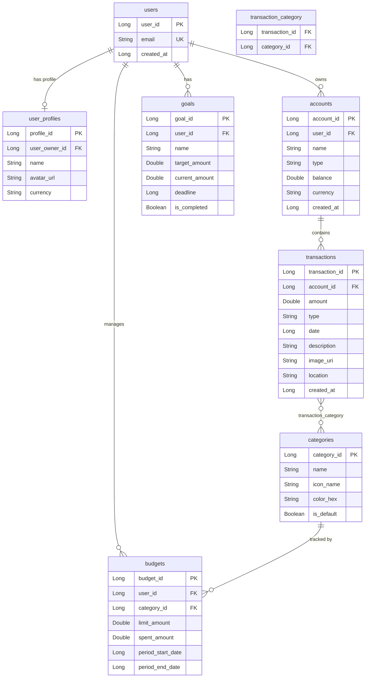

# FinTrack — Personal Finance Android App

A native Android personal finance application built with Kotlin and Jetpack Compose, following **Clean Architecture** principles. The app allows users to manage accounts, track income and expenses, monitor budgets, and set savings goals — all with a fully offline-first architecture backed by Room.

---

## Table of Contents

- [FinTrack — Personal Finance Android App](#fintrack--personal-finance-android-app)
  - [Table of Contents](#table-of-contents)
  - [Features](#features)
  - [Architecture](#architecture)
  - [Tech Stack](#tech-stack)
  - [Project Structure](#project-structure)
  - [Data Model](#data-model)
    - [Entity Relationship Overview](#entity-relationship-overview)
    - [Entities](#entities)
  - [Use Cases](#use-cases)
    - [Account (6)](#account-6)
    - [Transaction (7)](#transaction-7)
    - [Budget (6)](#budget-6)
    - [Category (5)](#category-5)
    - [Goal (6)](#goal-6)
    - [Settings (4)](#settings-4)
    - [Seed (1)](#seed-1)
  - [Database Seeding](#database-seeding)
    - [Default User](#default-user)
    - [Default Categories](#default-categories)
  - [Theme \& Design](#theme--design)
    - [Color Palette](#color-palette)
    - [Semantic Colors](#semantic-colors)
    - [Dynamic Theming](#dynamic-theming)
  - [Getting Started](#getting-started)
    - [Requirements](#requirements)
    - [Build \& Run](#build--run)
    - [First Launch](#first-launch)
  - [Project Info](#project-info)

---

## Features

| Module | Capabilities |
|---|---|
| **Dashboard** | Total balance overview, monthly income/expense summary, recent transactions, budget snapshot |
| **Accounts** | Create / edit / delete accounts, per-account transaction history, total balance calculation across all accounts |
| **Transactions** | Full CRUD, amount + date + description + account + category, income/expense type |
| **Categories** | Create / edit custom categories with color picker (10-color palette), default category protection, many-to-many link with transactions |
| **Budgets** | Create budgets per category with spending limits, real-time budget status (OK / WARNING / EXCEEDED) |
| **Goals** | Savings goals with target amount + deadline, contribution tracking, progress visualization |
| **Settings** | Light / Dark / System theme toggle, currency selector (USD / EUR), persisted via DataStore |
| **Database Seeding** | On first launch: inserts default user (`profesor@usj.com`) and 7 default categories automatically |

---

## Architecture

The app follows **Clean Architecture** with strict unidirectional dependency flow:

```
┌─────────────────────────────────────────┐
│  PRESENTATION (Compose + ViewModel)     │
│  Screens · ViewModels · Components      │
└─────────────────┬───────────────────────┘
                  │ calls Use Cases
┌─────────────────▼───────────────────────┐
│  DOMAIN (Pure Kotlin — zero Android)    │
│  Models · Repository Interfaces         │
│  Use Cases (business logic)             │
└──────────────┬──────────────────────────┘
               │ implemented by
┌──────────────▼──────────────────────────┐
│  DATA (Room · DataStore)                │
│  Entities · DAOs · Mappers              │
│  Repository Implementations             │
└─────────────────────────────────────────┘
```

**Key principles applied:**
- **Dependency Rule** — dependencies point inward; Domain has no Android imports
- **Single Source of Truth** — Room is the only source of truth for all persistent data
- **Unidirectional Data Flow** — `StateFlow<UiState>` from ViewModel → Composable
- **Offline-First** — the app works entirely without a network connection
- **Dependency Inversion** — Domain defines repository interfaces; Data implements them

---

## Tech Stack

| Technology | Version | Purpose |
|---|---|---|
| Kotlin | 2.x | Primary language |
| Jetpack Compose | BOM 2024 | Declarative UI |
| Material Design 3 | — | UI component system |
| Room | 2.6.1 | Local database (SQLite ORM) |
| Hilt | 2.50 | Dependency injection |
| Hilt Navigation Compose | 1.1.0 | ViewModel injection in nav graph |
| DataStore Preferences | 1.0 | Settings persistence |
| Navigation Compose | 2.7.x | Screen navigation |
| Coroutines + Flow | 1.7.x | Async operations + reactive streams |
| Timber | 5.0.1 | Structured logging |
| JDK | 17 | Compile toolchain |
| Min SDK | 26 (Android 8.0) | Device support floor |
| Target SDK | 34 (Android 14) | Target platform |

---

## Project Structure

```
com.usj.fintrack/
│
├── FinTrackApplication.kt          # @HiltAndroidApp · seeds DB on first launch
│
├── di/                             # Hilt modules
│   ├── DatabaseModule.kt           # Room DB + DAOs providers
│   └── RepositoryModule.kt         # @Binds interface → impl
│
├── data/                           # DATA LAYER
│   ├── dao/
│   │   ├── UserDao.kt
│   │   ├── AccountDao.kt
│   │   ├── TransactionDao.kt
│   │   ├── CategoryDao.kt
│   │   ├── BudgetDao.kt
│   │   └── GoalDao.kt
│   ├── database/
│   │   └──FinTrackDatabase.kt     # Room @Database (8 entities, version 1)
│   ├── entity/                     # Room @Entity classes
│   │   ├── UserEntity.kt
│   │   ├── UserProfileEntity.kt
│   │   ├── AccountEntity.kt
│   │   ├── TransactionEntity.kt
│   │   ├── CategoryEntity.kt
│   │   ├── TransactionCategoryCrossRef.kt
│   │   ├── BudgetEntity.kt
│   │   └── GoalEntity.kt
│   ├── mapper/                     # Entity ↔ Domain mappers
│   │   ├── UserMapper.kt
│   │   ├── AccountMapper.kt
│   │   ├── TransactionMapper.kt
│   │   ├── CategoryMapper.kt
│   │   ├── BudgetMapper.kt
│   │   └── GoalMapper.kt
│   ├── preferences/
│   │   └── UserPreferencesDataSource.kt   # DataStore
│   ├── relation/                   # Room @Relation helpers
│   │   ├── AccountWithTransactions.kt
│   │   └── TransactionWithCategories.kt
│   └── repository/                 # Repository implementations
│       ├── UserRepositoryImpl.kt
│       ├── AccountRepositoryImpl.kt
│       ├── TransactionRepositoryImpl.kt
│       ├── CategoryRepositoryImpl.kt
│       ├── BudgetRepositoryImpl.kt
│       └── GoalRepositoryImpl.kt
│
├── domain/                         # DOMAIN LAYER (zero Android deps)
│   ├── model/
│   │   ├── User.kt
│   │   ├── UserProfile.kt
│   │   ├── Account.kt
│   │   ├── Transaction.kt
│   │   ├── TransactionStats.kt
│   │   ├── Category.kt
│   │   ├── Budget.kt
│   │   ├── BudgetStatus.kt
│   │   ├── Goal.kt
│   │   ├── UserPreferences.kt
│   │   ├── AppTheme.kt
│   │   └── enum/
│   │       ├── AccountType.kt
│   │       ├── TransactionType.kt
│   │       ├── BudgetStatusType.kt
│   │       └── Currency.kt          # USD("$") · EUR("€")
│   ├── repository/                  # Interfaces (contracts)
│   │   ├── UserRepository.kt
│   │   ├── AccountRepository.kt
│   │   ├── TransactionRepository.kt
│   │   ├── CategoryRepository.kt
│   │   ├── BudgetRepository.kt
│   │   └── GoalRepository.kt
│   └── usecase/                     # Business logic
│       ├── account/   (6 use cases)
│       ├── transaction/ (7 use cases)
│       ├── budget/    (6 use cases)
│       ├── goal/      (6 use cases)
│       ├── category/  (5 use cases)
│       ├── settings/  (4 use cases)
│       └── seed/
│           └── SeedDatabaseUseCase.kt
│
└── presentation/                    # PRESENTATION LAYER
    ├── MainActivity.kt              # @AndroidEntryPoint · hosts NavGraph
    ├── navigation/
    │   ├── AppNavGraph.kt
    │   ├── Screen.kt
    │   └── BottomNavItem.kt
    ├── theme/
    │   ├── Color.kt                 # Brand palette + semantic income expense colors
    │   ├── Theme.kt                 # Light / Dark Material3 ColorSchemes
    │   └── Type.kt
    ├── component/                   # Shared reusable Composables
    │   ├── FinancialCard.kt
    │   ├── TransactionListItem.kt
    │   ├── BudgetProgressBar.kt
    │   ├── CategoryChip.kt
    │   ├── AmountTextField.kt
    │   ├── DatePicker.kt
    │   └── LoadingIndicator.kt
    ├── dashboard/
    ├── account/
    ├── transaction/
    ├── category/
    ├── budget/
    ├── goal/
    └── settings/
```

---

## Data Model

### Entity Relationship Overview

```
User ──1:1── UserProfile
User ──1:N── Account ──1:N── Transaction ──N:M── Category
User ──1:N── Goal
Category ──1:N── Budget
```



### Entities

| Entity | Table | Key Fields |
|---|---|---|
| `UserEntity` | `users` | `user_id`, `email` (unique), `created_at` |
| `UserProfileEntity` | `user_profiles` | `user_owner_id` (FK), `name`, `currency` |
| `AccountEntity` | `accounts` | `account_id`, `user_id` (FK), `name`, `balance`, `type` |
| `TransactionEntity` | `transactions` | `transaction_id`, `account_id` (FK CASCADE), `amount`, `type`, `date`, `description` |
| `CategoryEntity` | `categories` | `category_id`, `name`, `icon_name`, `color_hex`, `is_default` |
| `TransactionCategoryCrossRef` | `transaction_category` | `transaction_id` + `category_id` (composite PK) |
| `BudgetEntity` | `budgets` | `budget_id`, `category_id` (FK), `limit_amount`, `current_amount`, `period` |
| `GoalEntity` | `goals` | `goal_id`, `name`, `target_amount`, `current_amount`, `deadline` |

---

## Use Cases

### Account (6)
`CalculateTotalBalanceUseCase` · `CreateAccountUseCase` · `DeleteAccountUseCase` · `GetAccountByIdUseCase` · `GetAllAccountsUseCase` · `UpdateAccountUseCase`

### Transaction (7)
`CreateTransactionUseCase` · `DeleteTransactionUseCase` · `GetTransactionByIdUseCase` · `GetTransactionsByAccountUseCase` · `GetTransactionStatsUseCase` · `GetTransactionsUseCase` · `UpdateTransactionUseCase`

### Budget (6)
`CheckBudgetStatusUseCase` · `CreateBudgetUseCase` · `DeleteBudgetUseCase` · `GetBudgetByIdUseCase` · `GetBudgetsUseCase` · `UpdateBudgetUseCase`

### Category (5)
`CreateCategoryUseCase` · `DeleteCategoryUseCase` · `GetCategoriesUseCase` · `GetCategoryByIdUseCase` · `UpdateCategoryUseCase`

### Goal (6)
`AddGoalContributionUseCase` · `CreateGoalUseCase` · `DeleteGoalUseCase` · `GetGoalByIdUseCase` · `GetGoalsUseCase` · `UpdateGoalUseCase`

### Settings (4)
`GetCurrentUserUseCase` · `GetUserPreferencesUseCase` · `UpdateCurrencyUseCase` · `UpdateThemeUseCase`

### Seed (1)
`SeedDatabaseUseCase` — inserts default user and 7 default categories on first launch (idempotent)

---

## Database Seeding

On every app launch, `FinTrackApplication` runs `SeedDatabaseUseCase` on an IO coroutine. Both insertions are idempotent — they check for existing data before writing.

### Default User

| Field | Value |
|---|---|
| `id` | Auto-assigned (1 on first insert) |
| `email` | `profesor@usj.com` |
| `created_at` | Current timestamp at first launch |

### Default Categories

| Category | Color | Hex |
|---|---|---|
| Food | Orange | `#FF9800` |
| Transport | Blue | `#2196F3` |
| Entertainment | Purple | `#9C27B0` |
| Health | Pink | `#E91E63` |
| Housing | Green | `#4CAF50` |
| Salary | Teal | `#009688` |
| Other | Blue-grey | `#607D8B` |

Default categories are **protected from deletion** in the UI — the delete button is disabled for any category with `isDefault = true`.

---

## Theme & Design

The app uses a fully custom **Material Design 3** color scheme based on the FinTrack brand palette.

### Color Palette

| Role | Light | Dark |
|---|---|---|
| Primary | `#C62828` (BrandRed40) | `#FF8A80` (BrandRed80) |
| Secondary | `#F4511E` (BrandOrange40) | `#FFAB91` (BrandOrange80) |
| Tertiary | `#FFA000` (BrandYellow40) | `#FFD54F` (BrandYellow80) |

### Semantic Colors

| Semantic | Color | Usage |
|---|---|---|
| Income | `#1B8A6B` (IncomeGreen) | Positive amounts, balance |
| Expense | `#BA1A35` (ExpenseRed) | Negative amounts, spending |
| Income (dark) | `#6CDBAD` | Income on dark background |
| Expense (dark) | `#FFB3B8` | Expense on dark background |

### Dynamic Theming

Theme preference (Light / Dark / System) is persisted in **DataStore** and applied via `LocalCurrencySymbol` and `CompositionLocal` providers at the app root. Currency symbol (`$` / `€`) is propagated through the entire Compose tree via a `CompositionLocal`.

---

## Getting Started

### Requirements

- **Android Studio** Ladybug (2024.2.1) or newer
- **JDK 17** (configured in Android Studio SDK settings)
- **Android device or emulator** running API 26+ (Android 8.0 Oreo)
- **Gradle** 8.x (wrapper included — no manual install needed)

### Build & Run

```bash
# Clone the repository
git clone <repo-url>
cd Proyecto

# Open in Android Studio and let Gradle sync, OR build from CLI:
./gradlew assembleDebug

# Install on connected device / running emulator
./gradlew installDebug
```

On Windows use `gradlew.bat` instead of `./gradlew`.

### First Launch

On first launch the app automatically:
1. Creates the Room database (`fintrack_db`)
2. Seeds the default user (`profesor@usj.com`)
3. Seeds 7 default categories with assigned brand colors

No manual setup or server connection is required — the app is fully offline.

---

## Project Info

| Property | Value |
|---|---|
| Package | `com.usj.fintrack` |
| Database name | `fintrack_db` |
| Database version | `1` |
| Min SDK | 26 (Android 8.0) |
| Target SDK | 34 (Android 14) |
| Compile SDK | 36 |
| Version | 1.0 (versionCode 1) |
